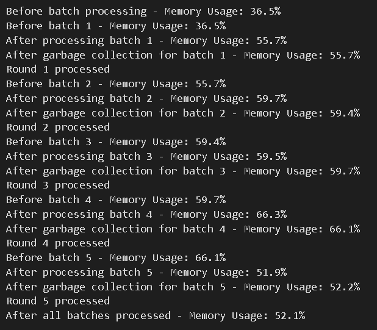

# Hate Speech Classification Project

This repository contains a machine learning project for classifying hate speech from text using a **Random Forest Classifier (RFC)**. The project achieves **83% accuracy** by leveraging **Word2Vec embeddings**, **Polars for data processing**, and various NLP techniques such as tokenization, lemmatization, and stopword removal. The pipeline was designed for efficiency, with special attention to the optimization of data handling and model performance.

The entire project was developed on a **AMD Ryzen 5 5500U** processor, ensuring efficient processing and fast execution.

---

## Project Overview

The goal of this project is to classify text as either **hate speech** or **non-hate speech** based on its content. The main steps in this project include:

1. **Data Preprocessing**: Tokenization, stopword removal, and lemmatization of text.
2. **Word Embeddings**: Using **Word2Vec** to convert text data into word vectors.
3. **Model Training**: Fitting a **Random Forest Classifier** on the preprocessed and vectorized text data.
4. **Hyperparameter Tuning**: Optimizing the Random Forest model using **GridSearchCV**.

### Key Features

- **Accuracy**: Achieved **83% accuracy** with RandomForestClassifier.
- **Efficiency**: Leveraged **Polars** for data manipulation, resulting in approximately **80% faster execution** compared to Pandas, especially when working with datasets of this scale.
- **Word2Vec**: Utilized **Word2Vec** for generating word embeddings, which allows the model to capture semantic meaning from text.
- **Model Choice**: Chose **RandomForestClassifier** for better performance in capturing non-linear relationships in the data.
- **Batch Processing**: Performed **batch processing** to preprocess the data, reducing the overhead on the CPU and improving memory efficiency.

---

## Project Structure

The 'Code Files' directory consists of the following files:

- **`word_embeddings.ipynb`**
  Converts text data into word embeddings using the **Word2Vec** model from **Gensim**. The model is trained in less than 3 minutes on a dataset with over 700k rows due to the use of **Polars** for efficient data processing.

- **`RFC_Hyperparameter_Tuning.ipynb`**  
  Performs hyperparameter tuning on the **Random Forest Classifier** using **GridSearchCV**. This step helps find the optimal set of hyperparameters for improving the model's performance.

- **`RandomForest_Classifier.ipynb`** 
  Fits the **Random Forest Classifier** on the training data and tests the model on the test data. The model achieves an accuracy of **83%** on the test set.

- **`Word2Vec.ipynb`**  
  Trains a **Word2Vec** model on the dataset, which generates word embeddings for each word in the vocabulary. These embeddings are then used for input to the RandomForestClassifier.

---

## Technologies & Libraries Used

- **Python**: The primary language for the implementation.
- **Polars**: Used for data manipulation due to its performance advantages. Polars is **3x-10x faster** than Pandas in handling large datasets. It utilizes an **Arrow-based memory model**, **lazy execution**, and **built-in multi-threading** to achieve these speed improvements. The efficiency of Polars was particularly evident when working with datasets containing over 700k rows.
- **NLTK**: Used for text preprocessing, including tokenization, stopword removal, and lemmatization.
- **Gensim**: Used for training the **Word2Vec** model, converting words into vectors.
- **Scikit-learn**: Contains the implementation of the **RandomForestClassifier** and **GridSearchCV** for hyperparameter tuning.
- **NumPy**: Used for numerical operations and array manipulation.

---

## Why Random Forest Classifier?

- **Ensemble Method**: Random Forest is an ensemble method that aggregates multiple decision trees, which allows it to capture complex patterns in data and make more accurate predictions.
- **Non-linear Relationships**: Unlike **Logistic Regression**, which struggles with non-linear relationships, **Random Forest** can handle complex, non-linear data effectively.
- **SVM Consideration**: The **Support Vector Machine (SVM)** was discarded because it is a **distance-based model** that requires data scaling. Scaling would lose the semantic meaning of the word vectors, which are crucial for this task.

---

## Performance & Results

- The model achieves an **83% accuracy** on the test data, which is a strong result for this text classification problem.
- Hyperparameter tuning via **GridSearchCV** helped optimize the **RandomForestClassifier**, leading to improved performance over default settings.

---

## Efficiency and Batch Processing

The entire project was developed and optimized on an **AMD Ryzen 5 5500U** processor. In addition, **batch processing** techniques were used during the data preprocessing phase, which helped reduce the overhead on the CPU. This ensures that the pipeline is both **CPU-efficient** and capable of handling large datasets effectively.

### Efficient Memory Management

By utilizing **Polars** for data manipulation, the project benefits from the **Arrow-based memory model**, which ensures optimal memory management. Batch processing allowed large chunks of data to be processed simultaneously, leading to better CPU utilization and reduced processing time. This is particularly useful when working with datasets as large as the one used in this project (over 700k rows).

---

## Getting Started

### Prerequisites

To use this repository:
    
- `git clone https://github.com/SiddharthCh7/Hate-Speech-Classification-using-Polars`
    
- `cd Hate-Speech-Classification-using-Polars`
    
- `pip install -r requirements.txt`
